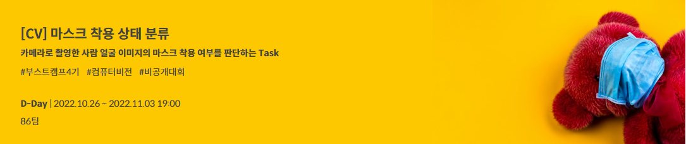
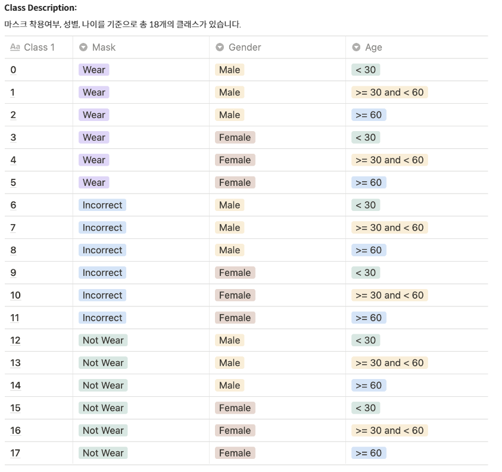
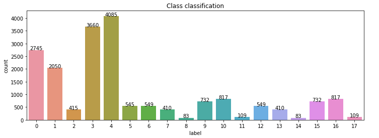
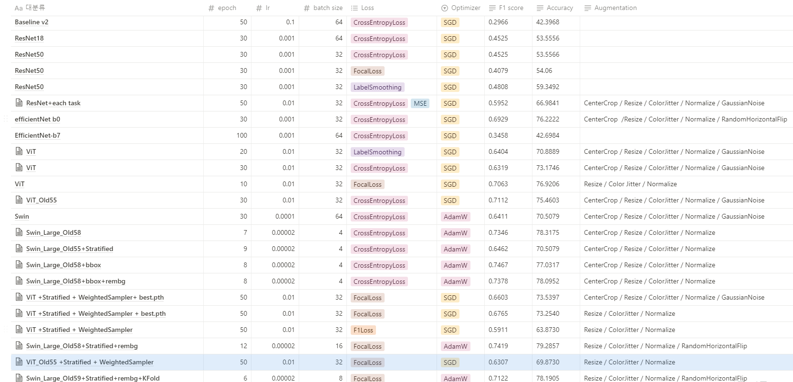
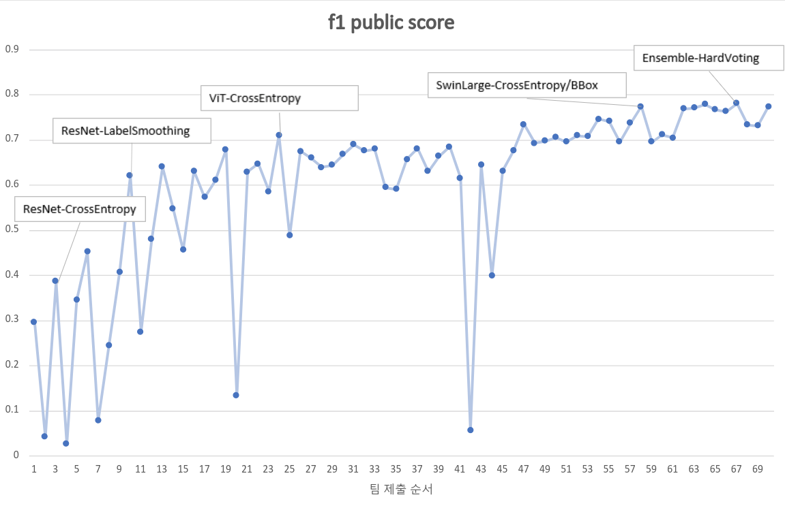
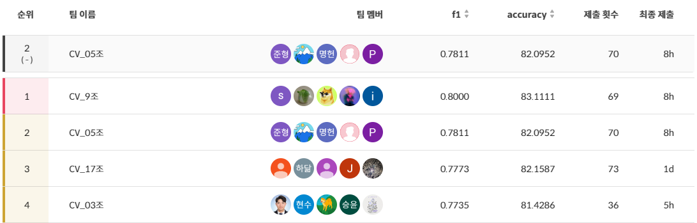
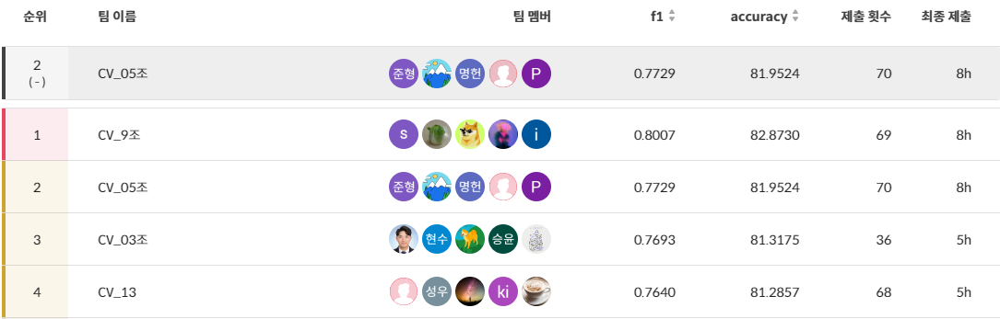

# 마스크 착용 상태 분류 

Naver BoostCamp AI Tech 4기 CV-5조 마스크 착용 상태 분류 프로젝트

🥈 **리더보드(public) 2위**

🥈 **리더보드(Private) 2위**

## 1. 프로젝트 개요

### 📙 프로젝트 주제 

- 카메라로 촬영한 4500명의 이미지를 통해 **마스크, 성별, 연령**을 파악

- 📆 **대회 기간** : 2022.10.26 ~ 2022.11.03 

- 🛠 **개발 환경**
  - 개발 환경 : VSCode, Jupyter Notebook, GPU(Tesla V100)
  - 협업 Tools : GitHub, Notion, Zoom

## 2.  팀원 소개 

<table>
  <tr>
    <td align="center"><a href="https://github.com/DHKim95"> <b>김도훈 </b></a> </td>
    <td align="center"><a href="https://github.com/sshinohs"> <b>신성윤 </b></a> </td>
    <td align="center"><a href="https://github.com/JunghoYoo"> <b>유정호 </b></a> </td>
    <td align="center"><a href="https://github.com/MyeongheonChoi"> <b>최명헌 </b></a> </td>
    <td align="center"><a href="https://github.com/jun981015"> <b>홍준형 </b></a> </td>
    </tr>
</table>

### 👨‍👨‍👦‍👦 팀원 역할

|  팀원  |                             역할                             |
| :----: | :----------------------------------------------------------: |
| 김도훈 | EDA & Data Augmentation ResNet, efficientNet, ViT 실험 및 Hyper Parameter Tuning |
| 신성윤 | Data Imbalance 문제 해결을 위한 Stratified Dataset 구현 및 Data Augmentation Soft Voting Ensemble |
| 유정호 | Data Augmentation(Face bounding box) & Hyper Parameter Tuning Related Works Research |
| 최명헌 | SwinTransformer 모델 실험 및 Hyper Parameter Tuning 및 Label 실험  Hard Voting Ensemble & K-Fold Cross Validation |
| 홍준형 | Mask/Age/Age를 각각 예측하는 모델 구현 및 실험 Age class 세분화 및 경계 부분 제외 실험, 마스크 착용 유무에 따른 나이 예측 모델 실험 |

## 3. Project 

### 📌 Process

1. Problem Definition

   > 마스크 착용여부, 성별, 나이에 따라 18개의 클래스로 Multi Classification 하는 모델 구현

2. EDA를 통한 Data imbalance 확인

3. Data 관련 가설 설정

   1. **60세 이상의 데이터가 부족하여 Class의 imbalance 발생**

      - MaskStratifiedDataset → train / val의 class 비율 유지하면서 나누기

      - MaskSplitByProfileDataset → train / val 나누기를 사람을 기준으로 나누기 

      - Weight Sampler → 클래스별 weight를 부여하여 동일 수 데이터 학습

   2. **55세 이상의 데이터 Label이 오류가 있는 것 같다**

      - Old Label을 55, 57, 58로 조정하여 실험 → f1 Score 성능 향상

   3. **적절한 데이터 증강 기법을 적용하면 모델의 일반화 성능을 올릴 수 있을 것이다.**

      - RandomRotation, CenterCrop, GaussianBlur, Colorjitter → CenterCrop을 제외하고 성능차이에 크게 영향이 없었음
      - 학습에 필요가 없는 배경 제거 전처리 → rembg 사용을 통해 성능 향상

   4. **사진 속 인물의 배경이 다양하고 데이터가 같은 위치에 없기 때문에 CenterCrop이 영향이 없다**

      - DeepFace를 이용하여 bounding box를 추출하고 모듈화 → 인물의 위치 일치

4. Model Selection and Analysis

   1. **CNN 모델보다는 Transformer모델이 복잡한 데이터를 추론하는데 성능이 좋을 것이다.**
      - Transformer의 attention 구조로 아래 문제점 보완(Translation equivalence, Locality) → f1 score 성능 향상
   2. **ViT보다는 Swin Transformer가 shifted window를 사용하여 사진 가장자리의 정보도 잘 학습할 것이다.**
      - Shifted window 구조로 크기의 특징 유리, hierarchical 구조로 다양한 view 이미지 볼 수 있음 → f1 score 성능 향상

   

### 📈 F1 Score Record

### 💡 Result

- Public Leaderboard

  

- Private Leaderboard

  

